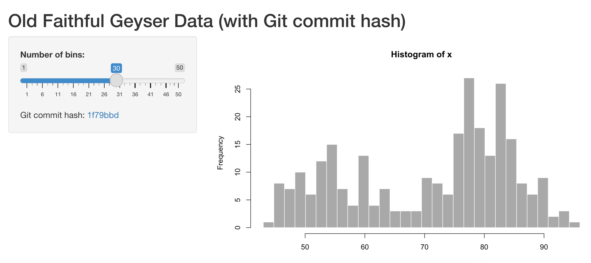

# Git Commit hash shiny app example

A small example app that can display it's own git commit hash when deployed to 
RStudio Connect.

This app requires RStudio Connect version 1.8.8 or above.

When deployed to Connect the app uses `httr` to query the Connect API and retrieve the git commit hash associated with the deployed application.
